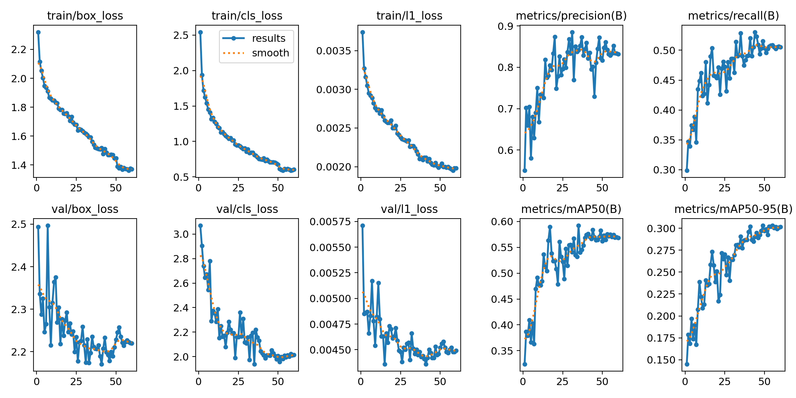
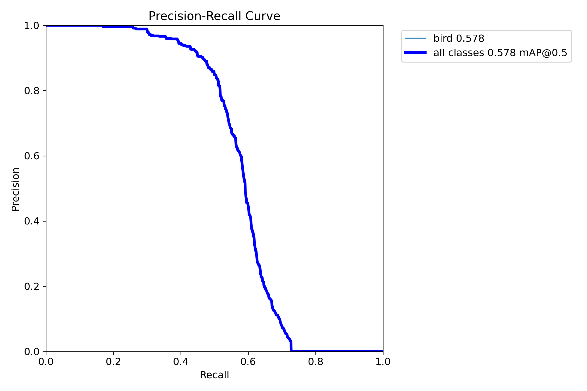
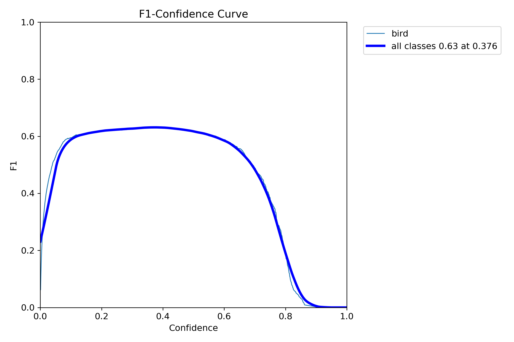
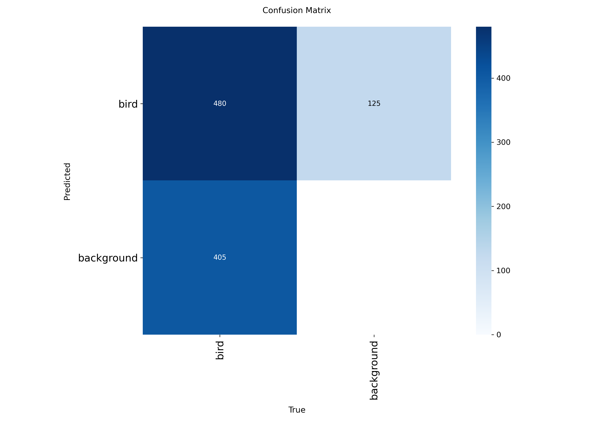

# Bird Detection with YOLO26n

Single-class bird detector based on YOLO26n, trained for flying bird detection in surveillance-style video footage.

**Dataset:** FBD-SV-2024 — Flying Bird Object Detection Dataset in Surveillance Video  
**Kaggle:** [FBD-SV-2024 on Kaggle](https://www.kaggle.com/datasets/swjtuziwei/fbd-sv-2024)  
**Dataset repository:** [FBD-SV-2024 on GitHub](https://github.com/Ziwei89/FBD-SV-2024_github)  
**Paper:** [FBD-SV-2024: Flying Bird Object Detection Dataset in Surveillance Video](https://doi.org/10.1038/s41597-025-04872-6)

> **Disclaimer**
>
> This project was developed as part of a technical test assignment and is intended solely for demonstration, learning, and evaluation purposes.
>
> The FBD-SV-2024 dataset authors state that the dataset is intended for learning and research purposes and not for commercial use. This project, the trained model, and the included examples are not intended to be used for commercial activity.

## Overview

The project implements an end-to-end pipeline for detecting birds in video using YOLO26n.

It includes:

- preparation of the FBD-SV-2024 dataset for YOLO;
- conversion of XML bounding-box annotations to YOLO format;
- deterministic train/validation subset selection;
- inclusion of in-domain background frames as negative samples;
- YOLO26n fine-tuning for a single `bird` class;
- video inference with bounding boxes and confidence scores;
- trained weights and validation metrics;
- example input and processed videos.

The model is primarily intended for fixed-camera and CCTV-style footage containing flying birds.

## Project Structure

```text
bird-detector/
├── examples/
│   ├── input/              # Example source videos
│   └── output/             # Videos with bird detections
├── results/
│   ├── BoxF1_curve.png
│   ├── BoxPR_curve.png
│   ├── confusion_matrix.png
│   ├── confusion_matrix_normalized.png
│   ├── results.csv
│   └── results.png
├── weights/
│   └── best.pt             # Best trained model
├── prepare_dataset.py
├── train.py
├── predict_video.py
├── requirements.txt
└── README.md
```

The raw and processed datasets, local virtual environment, and full training runs are excluded from the repository.

## Dataset

The model was trained using FBD-SV-2024, a dataset designed specifically for flying bird detection in surveillance video.

The original dataset contains 483 video clips and 28,694 video frames. It includes both frames containing flying birds and background frames without birds.

For this project, a deterministic subset was created:

| Split | Images | Bird images | Backgrounds | Bird boxes |
| --- | ---: | ---: | ---: | ---: |
| Train | 5000 | 4000 | 1000 | 4754 |
| Validation | 1000 | 800 | 200 | 885 |

The original video-level train/validation split is preserved. This prevents neighboring frames from the same video from appearing in both training and validation data.

Background frames close in time to frames containing birds are prioritized during dataset preparation. These frames provide more relevant in-domain negative examples than unrelated images from external datasets.

The original FBD-SV-2024 dataset is not included in this repository.

### Download

The dataset can be downloaded from Kaggle using the identifier:

```text
swjtuziwei/fbd-sv-2024
```

For example, with the Kaggle CLI:

```bash
kaggle datasets download \
    -d swjtuziwei/fbd-sv-2024 \
    -p data/raw/fbd
```

After extraction, the expected source structure is:

```text
data/raw/fbd/FBD-SV-2024/
├── labels/
│   ├── train/
│   └── val/
└── videos/
    ├── train/
    └── val/
```

## Installation

Python 3.10 was used during development.

Create and activate a virtual environment:

```bash
python -m venv .venv
source .venv/bin/activate
```

Install the dependencies:

```bash
pip install -r requirements.txt
```

## Dataset Preparation

Run:

```bash
python prepare_dataset.py
```

The script performs the following steps:

1. reads the original XML annotations;
2. preserves the original train/validation video split;
3. selects 5000 training and 1000 validation frames;
4. maintains an 80/20 positive-to-background ratio;
5. prioritizes difficult background frames located near positive bird frames;
6. extracts only the selected frames from the source videos;
7. converts bounding boxes from XML to YOLO format;
8. validates the generated labels;
9. creates the YOLO dataset configuration.

The processed dataset is stored in:

```text
data/processed/
├── train/
│   ├── images/
│   └── labels/
├── val/
│   ├── images/
│   └── labels/
└── dataset.yaml
```

Custom subset sizes can also be specified:

```bash
python prepare_dataset.py \
    --train-size 5000 \
    --val-size 1000 \
    --positive-ratio 0.8
```

## Training

Train the model with:

```bash
python train.py
```

Default configuration:

| Parameter | Value |
| --- | --- |
| Model | YOLO26n |
| Classes | 1 (`bird`) |
| Epochs | 60 |
| Image size | 768 |
| Batch size | 8 |
| Optimizer | AdamW |
| Initial learning rate | 0.001 |
| LR scheduler | Cosine |
| Early stopping patience | 15 |
| Seed | 42 |

The training script automatically uses CUDA when available.

The best checkpoint is copied to:

```text
weights/best.pt
```

Full Ultralytics training artifacts are stored locally in:

```text
runs/
```

## Validation Results

The final model achieved:

| Metric | Value |
| --- | ---: |
| Precision | 0.834 |
| Recall | 0.509 |
| mAP@0.5 | 0.578 |
| mAP@0.5:0.95 | 0.304 |

Validation inference speed on an NVIDIA GeForce RTX 3050 Laptop GPU was approximately:

```text
2.6 ms / image
```

for model inference.

### Training Results



### Precision-Recall Curve



### F1 Curve



### Confusion Matrix



The complete epoch-by-epoch metrics are available in:

```text
results/results.csv
```

## Video Inference

Example source videos are stored in:

```text
examples/input/
```

Run:

```bash
python predict_video.py
```

The script prompts for the video name:

```text
Input video name from examples/input/ (without .mp4): bird_136
```

The corresponding file:

```text
examples/input/bird_136.mp4
```

is processed and the result is automatically saved to:

```text
examples/output/bird_136_detected.mp4
```

The detector draws:

- a bounding box around each detected bird;
- the `bird` class label;
- the detection confidence score.

The script can also be used directly from the command line:

```bash
python predict_video.py --input bird_136
```

```bash
python predict_video.py \
    --input examples/input/bird_136.mp4 \
    --output examples/output/bird_136_detected.mp4
```

Optional inference parameters can be changed:

```bash
python predict_video.py \
    --input bird_136 \
    --conf 0.25 \
    --imgsz 768
```

By default, CUDA is used when available and CPU inference is used as a fallback.

## Example Videos

The repository contains several validation videos in:

```text
examples/input/
```

with their processed versions in:

```text
examples/output/
```

These videos originate from the FBD-SV-2024 validation split and were not used for gradient-based model training.

They demonstrate the detector on surveillance-style footage representative of the model's intended application domain.

## Observations and Limitations

The detector performs well on surveillance-style footage similar to the FBD-SV-2024 training domain, particularly for flying birds observed by fixed cameras.

A noticeable domain shift was observed when testing the model on unrelated wildlife footage. Examples included:

- very large close-up birds;
- unusual bird poses;
- partially visible birds;
- cinematic wildlife footage;
- scenes containing large mammals and people;
- significantly different camera viewpoints and image statistics.

This behavior suggests that dataset diversity is an important limitation of the current model.

The validation set also contains many small bird instances, which makes recall more challenging than precision. The final model achieves higher precision than recall, indicating that missed detections remain a larger issue than false positive detections within the validation domain.

## Possible Improvements

Several improvements could be explored in future work:

- combine FBD-SV-2024 with a more diverse bird detection dataset;
- include additional large and close-up bird examples;
- increase representation of partially occluded and motion-blurred birds;
- experiment with a larger YOLO model;
- use a higher inference resolution for very small objects;
- tune the confidence threshold according to the required precision/recall trade-off;
- add object tracking for improved temporal consistency between video frames;
- evaluate the model on additional independent CCTV datasets.

## Model Weights

The final trained checkpoint is included in:

```text
weights/best.pt
```

The weights correspond to the model used to generate the validation metrics and example videos included in this repository.

## Reproducibility

Dataset sampling uses a fixed random seed:

```text
42
```

Training is also configured with deterministic behavior and the same seed where supported.

The repository therefore contains the scripts required to reproduce:

1. dataset preparation;
2. YOLO training;
3. validation results;
4. video inference.

## Acknowledgements

The project uses the FBD-SV-2024 dataset created by Zi-Wei Sun, Ze-Xi Hua, Heng-Chao Li, Zhi-Peng Qi, Xiang Li, Yan Li, and Jin-Chi Zhang.

If the dataset is used in further research, please refer to the original publication:

**FBD-SV-2024: Flying Bird Object Detection Dataset in Surveillance Video**  
Scientific Data, Volume 12, Article 530, 2025  
DOI: `10.1038/s41597-025-04872-6`

The full FBD-SV-2024 dataset is not redistributed in this repository. The example videos included under `examples/` are sourced from the validation split and are provided solely for non-commercial demonstration and evaluation purposes, with attribution to the original dataset authors.
